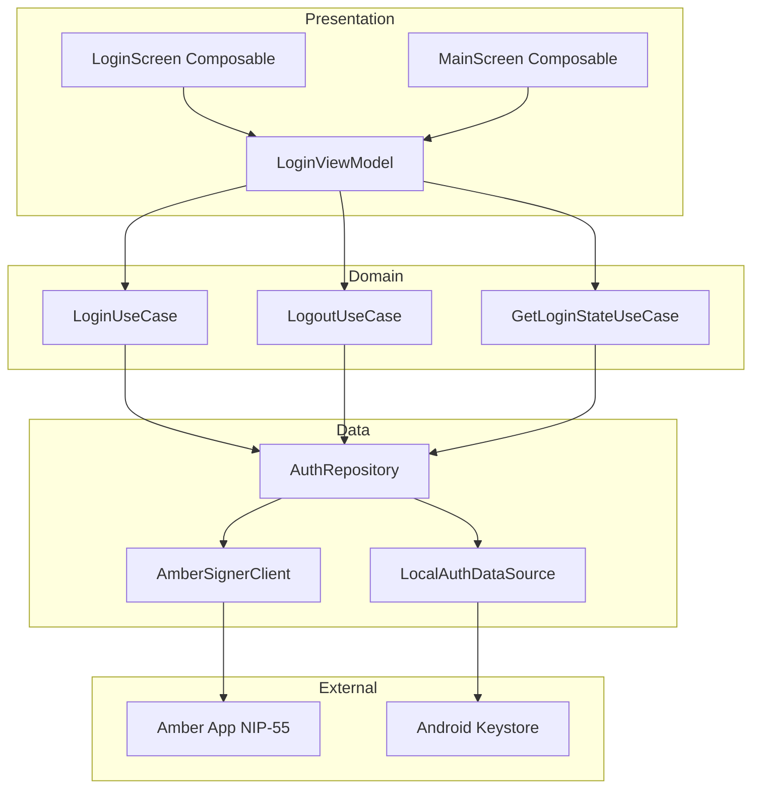
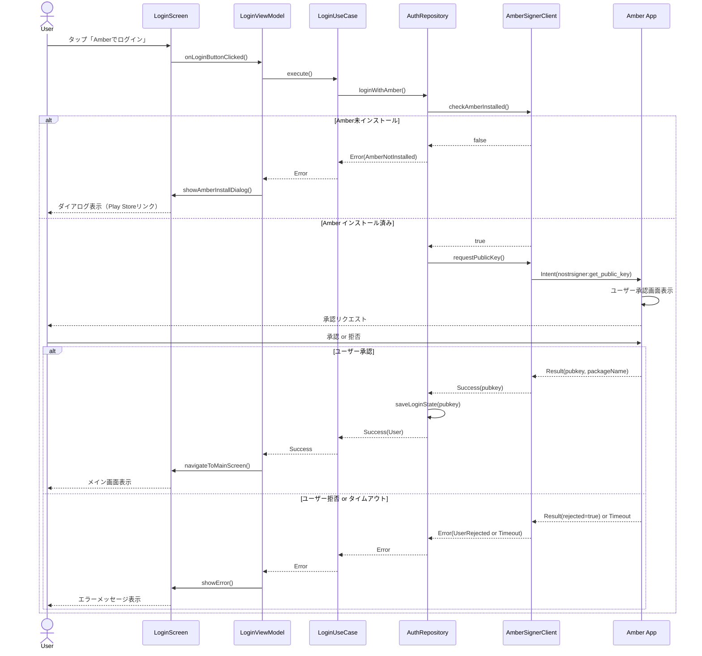
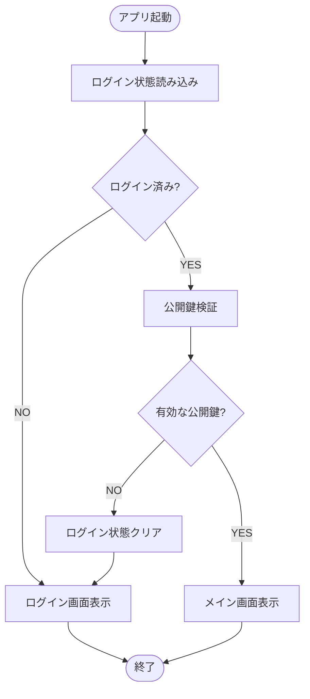
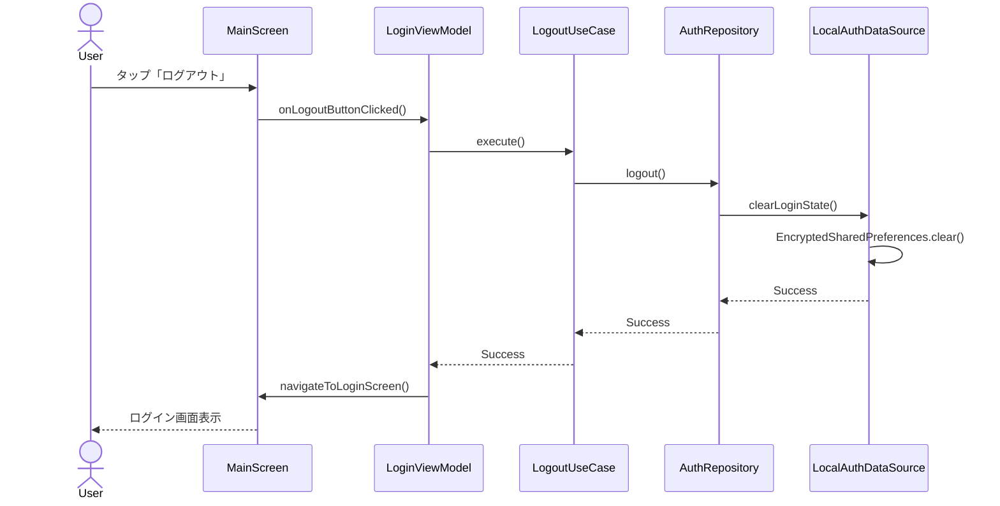
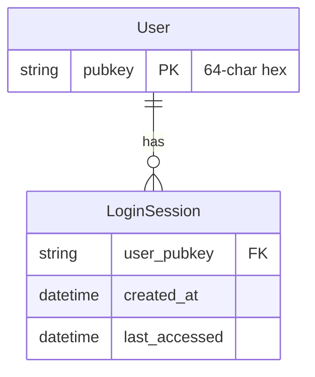
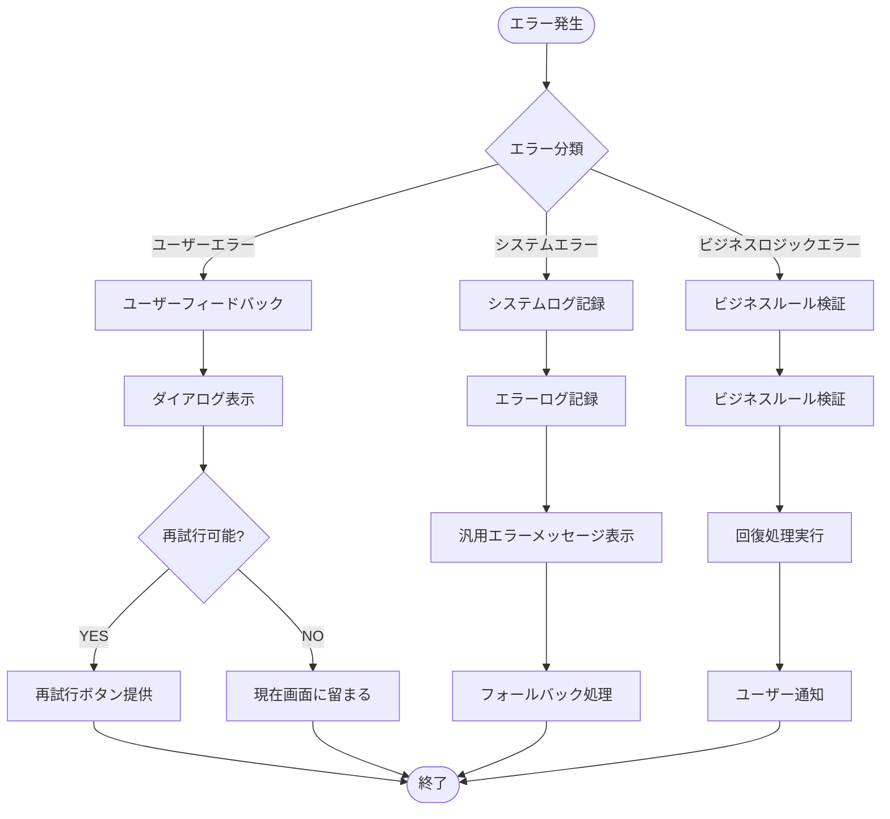

# 技術設計書

## 概要

本設計書は、NostrブックマークアプリケーションPinosuにおける、Amberアプリを介したNIP-46認証機能の技術設計を定義する。本機能により、ユーザーは秘密鍵を直接保持することなく、Android標準のIntent機構を通じてセキュアにNostrアカウントへログインできる。

**目的**: 本機能は、Nostrユーザーに対してセキュアで使いやすいログイン体験を提供する。Amberアプリ（外部署名者）を活用することで、秘密鍵の管理責任をユーザーの専用署名デバイスに委譲し、Pinosuアプリ自体は公開鍵のみを保持する。

**ユーザー**: NostrプロトコルユーザーがAmberアプリを使用してPinosuにログインする。ログイン後は、将来的にブックマーク機能（kind 10003）を利用するための基盤となる。

**影響**: 本機能は新規機能であり、既存システムへの影響はない。将来的なブックマーク機能の前提条件として、ユーザー認証基盤を確立する。

### ゴール

- AmberアプリとのNIP-55プロトコル統合により、セキュアなログイン機能を提供
- ログイン状態の永続化により、アプリ再起動後もユーザー体験を維持
- Amber未インストール時の適切なユーザーガイダンス
- Android標準のセキュリティベストプラクティス（Keystore, EncryptedSharedPreferences）に準拠

### 非ゴール

- リレーサーバーへの接続（将来フェーズで実装）
- ブックマーク機能（kind 10003）の実装
- 複数アカウント管理
- iOS対応
- NIP-46リレー経由通信の直接実装（NIP-55を使用）
- オフライン認証機能

## アーキテクチャ

> 詳細な調査内容は`research.md`を参照。本設計書は、レビュアーが独立して理解できるよう、すべての決定と契約を含む自己完結型として作成。

### アーキテクチャパターン & 境界マップ

**選定パターン**: Clean Architecture + MVVM (Model-View-ViewModel)

**選定理由**:

- Jetpack Composeとの高い親和性
- レイヤー分離によるテスタビリティとメンテナビリティの向上
- Android公式推奨アーキテクチャ
- ログイン状態管理がViewModelで明確化され、UI層とビジネスロジックの分離が明確

**ドメイン/機能境界**:

- **Presentation層**: Jetpack ComposeによるUI、ViewModelによる状態管理
- **Domain層**: ログイン/ログアウトユースケース、ビジネスルール
- **Data層**: リポジトリパターン、Amber統合、ローカルストレージ

**既存パターンの保持**:

- 新規実装のため該当なし

**新規コンポーネントの根拠**:

- `AuthRepository`: データソースの抽象化、将来的な認証方法の追加に対応
- `AmberSignerClient`: Amber固有の通信ロジックをカプセル化、NIP-55プロトコルの詳細を隠蔽
- `LoginViewModel`: ログイン状態管理、UI層との疎結合を実現

**ステアリング遵守**:

- ステアリングディレクトリが存在しないため、Android標準ベストプラクティスに準拠



### 技術スタック

| レイヤー | 選定技術 / バージョン | 機能における役割 | 備考 |
|-------|------------------|-----------------|------|
| フロントエンド / UI | Jetpack Compose (最新安定版) | UIレンダリング、宣言的UI | Android推奨UI framework |
| プレゼンテーション | Android ViewModel (Lifecycle 2.6+) | 状態管理、ライフサイクル対応 | MVVM architecture |
| ドメイン層 | Kotlin (1.9+) | ビジネスロジック実装 | Coroutines使用 |
| データ層 / Nostr | Amethyst Quartz (latest) | Nostrプロトコル実装、NostrSignerExternal | Maven Central提供 |
| データ層 / 通信 | ActivityResultAPI (Android Jetpack) | Amber Intentレスポンス処理 | startActivityForResult非推奨の代替 |
| データ / ストレージ | EncryptedSharedPreferences (Security-crypto 1.1+) | ログイン状態の暗号化保存 | Android Jetpack Security |
| データ / セキュリティ | Android Keystore System | マスターキー保護、TEE/SE活用 | API 23+ |
| ランタイム | Android SDK 26+ (targetSdk 34) | アプリ実行環境 | minSdk 26 (Android 8.0) |

**技術選定根拠サマリー** (詳細は`research.md`参照):

- **Jetpack Compose**: モダンなAndroid UI開発、宣言的UIによる保守性向上
- **Amethyst Quartz**: `NostrSignerExternal`がAmber統合を直接サポート、実戦投入済み
- **ActivityResultAPI**: Android 13+対応、Contract-based APIでタイプセーフ
- **EncryptedSharedPreferences + Keystore**: Android標準セキュリティ、AES256暗号化、TEE/SE保護

## システムフロー

### ログインフロー（Amber連携）



### アプリ起動時のログイン状態確認フロー



### ログアウトフロー



## 要件トレーサビリティ

| 要件ID | 要約 | コンポーネント | インターフェース | フロー |
|-------|------|------------|------------|------|
| 1.1 | ログインボタンタップでAmber連携開始 | LoginScreen, LoginViewModel, AmberSignerClient | LoginViewModel.onLoginButtonClicked(), AmberSignerClient.requestPublicKey() | ログインフロー |
| 1.2 | Amber未インストール時にダイアログ表示 | AmberSignerClient, LoginScreen | AmberSignerClient.checkAmberInstalled() | ログインフロー（分岐） |
| 1.3 | Amberからの認証レスポンスでNIP-46接続確立 | AmberSignerClient, AuthRepository | AmberSignerClient.handleAmberResponse() | ログインフロー |
| 1.4 | 認証成功時に公開鍵取得・保存 | AuthRepository, LocalAuthDataSource | AuthRepository.saveLoginState(), LocalAuthDataSource.saveUser() | ログインフロー |
| 1.5 | 認証失敗時にエラーメッセージ表示 | LoginViewModel, LoginScreen | LoginViewModel.showError() | ログインフロー（エラー分岐） |
| 2.1 | 認証成功時にログイン状態をローカルストレージに保存 | LocalAuthDataSource | LocalAuthDataSource.saveUser() | ログインフロー |
| 2.2 | アプリ起動時に保存されたログイン状態確認 | AuthRepository, LocalAuthDataSource | AuthRepository.getLoginState(), LocalAuthDataSource.getUser() | 起動フロー |
| 2.3 | ログイン済み状態でメイン画面表示 | MainScreen, LoginViewModel | GetLoginStateUseCase.execute() | 起動フロー |
| 2.4 | ログアウト機能提供 | MainScreen, LogoutUseCase | MainScreen.onLogoutButtonClicked(), LogoutUseCase.execute() | ログアウトフロー |
| 2.5 | ログアウト時にログイン状態クリア | LocalAuthDataSource | LocalAuthDataSource.clearLoginState() | ログアウトフロー |
| 3.1 | ログイン画面に「Amberでログイン」ボタン配置 | LoginScreen | LoginScreen Composable | - |
| 3.2 | ログイン処理中にローディングインジケーター表示 | LoginScreen, LoginViewModel | LoginViewModel.uiState (Loading) | ログインフロー |
| 3.3 | ログイン成功時にメッセージ表示 | LoginScreen, LoginViewModel | LoginViewModel.uiState (Success) | ログインフロー |
| 3.4 | メイン画面にログアウトボタン配置 | MainScreen | MainScreen Composable | - |
| 3.5 | メイン画面にログイン中のpubkey表示 | MainScreen, LoginViewModel | LoginViewModel.userPubkey | - |
| 4.1 | NIP-46 Nostr Connectプロトコル実装 | AmberSignerClient, Quartz NostrSignerExternal | AmberSignerClient (NIP-55経由で間接実装) | - |
| 4.2 | Amberとの通信でNIP-46メッセージフォーマット使用 | AmberSignerClient | AmberSignerClient (NIP-55 Intent経由) | ログインフロー |
| 4.3 | Amethystライブラリ活用 | AmberSignerClient, Quartz | NostrSignerExternal | - |
| 4.4 | 認証に必要な暗号化・復号化処理実装 | AmberSignerClient, Quartz | Quartz暗号化関数 | - |
| 4.5 | 通信エラー時の適切なエラーハンドリング | AmberSignerClient, AuthRepository | AmberSignerClient.handleError() | ログインフロー（エラー分岐） |
| 5.1 | Amber未検出時にPlay Storeリンクとエラーメッセージ表示 | LoginScreen, AmberSignerClient | LoginScreen.showAmberInstallDialog() | ログインフロー（Amber未インストール） |
| 5.2 | ネットワークエラー時にメッセージ表示 | LoginViewModel | LoginViewModel.showError() | - |
| 5.3 | Amberレスポンス不正時にエラーログ記録と汎用エラー表示 | AmberSignerClient | AmberSignerClient.handleError() | ログインフロー（エラー分岐） |
| 5.4 | タイムアウト時に再試行オプション提供 | LoginScreen, LoginViewModel | LoginScreen.showRetryDialog() | ログインフロー（タイムアウト） |
| 5.5 | すべてのエラーメッセージを日本語で表示 | LoginScreen, MainScreen | Strings.xml (日本語リソース) | - |
| 6.1 | 秘密鍵を一切保存しない | AuthRepository | 設計原則（Amber側で管理） | - |
| 6.2 | ローカルストレージのデータ暗号化 | LocalAuthDataSource | EncryptedSharedPreferences | - |
| 6.3 | センシティブデータログ出力時にマスキング | AmberSignerClient, AuthRepository | Logger.maskSensitiveData() | - |
| 6.4 | 通信時にHTTPS使用 | - | NIP-55はIntent経由（該当なし） | - |
| 6.5 | Android Keystore活用でセッションキー保護 | LocalAuthDataSource | Android Keystore (EncryptedSharedPreferencesが内部使用) | - |

## コンポーネントとインターフェース

### コンポーネント概要

| コンポーネント | ドメイン/層 | 目的 | 要件カバレッジ | 主要依存関係 (P0/P1) | 契約 |
|------------|-----------|------|------------|-------------------|------|
| LoginScreen | Presentation/UI | ログイン画面のUI表示 | 1.1, 1.2, 1.5, 3.1, 3.2, 3.3, 5.1, 5.4, 5.5 | LoginViewModel (P0) | State |
| MainScreen | Presentation/UI | メイン画面のUI表示、pubkey表示、ログアウトボタン | 2.3, 3.4, 3.5, 5.5 | LoginViewModel (P0) | State |
| LoginViewModel | Presentation | ログイン状態管理、UI状態制御 | 1.1, 1.5, 2.2, 2.3, 2.4, 3.2, 3.3, 3.5, 5.2, 5.4 | LoginUseCase (P0), LogoutUseCase (P0), GetLoginStateUseCase (P0) | State |
| LoginUseCase | Domain | ログイン処理のビジネスロジック | 1.1, 1.3, 1.4, 1.5, 4.5 | AuthRepository (P0) | Service |
| LogoutUseCase | Domain | ログアウト処理のビジネスロジック | 2.4, 2.5 | AuthRepository (P0) | Service |
| GetLoginStateUseCase | Domain | ログイン状態取得のビジネスロジック | 2.2, 2.3 | AuthRepository (P0) | Service |
| AuthRepository | Data | 認証データソースの抽象化、ログイン状態管理 | 1.3, 1.4, 2.1, 2.2, 2.5, 4.5, 6.1 | AmberSignerClient (P0), LocalAuthDataSource (P0) | Service |
| AmberSignerClient | Data | Amber NIP-55 Intent通信のカプセル化 | 1.1, 1.2, 1.3, 1.5, 4.1, 4.2, 4.3, 4.4, 4.5, 5.1, 5.3, 6.3 | Quartz NostrSignerExternal (P0), ActivityResultLauncher (P0) | Service |
| LocalAuthDataSource | Data | ローカルストレージへのログイン状態永続化 | 1.4, 2.1, 2.2, 2.5, 6.2, 6.5 | EncryptedSharedPreferences (P0), Android Keystore (P0) | Service |

### Presentation層

#### LoginScreen

| 項目 | 詳細 |
|-----|------|
| 目的 | ログイン画面のUIレンダリング、ユーザー操作の処理 |
| 要件 | 1.1, 1.2, 1.5, 3.1, 3.2, 3.3, 5.1, 5.4, 5.5 |
| 実装方式 | Jetpack Composable関数 |

**責任と制約**:

- ログインボタンの表示とタップ処理
- ローディング状態の視覚的表示
- エラーダイアログ表示（Amber未インストール、タイムアウト、その他エラー）
- ログイン成功時のメイン画面への遷移
- UIロジックのみ、ビジネスロジックはViewModelに委譲

**依存関係**:

- Inbound: なし（エントリポイント）
- Outbound: LoginViewModel — 状態観察、ユーザー操作の委譲 (P0)
- External: Jetpack Compose — UIレンダリング (P0)

**契約**: State [x]

##### State管理

```kotlin
// LoginScreenで観察するUIState
data class LoginUiState(
    val isLoading: Boolean = false,
    val errorMessage: String? = null,
    val showAmberInstallDialog: Boolean = false,
    val loginSuccess: Boolean = false
)
```

**実装ノート**:

- **統合**: LoginViewModelの`uiState: StateFlow<LoginUiState>`を`collectAsState()`で観察
- **検証**: エラーメッセージは常に日本語文字列リソース（strings.xml）から取得
- **リスク**: Amber未インストール時のPlay Storeリンクが正しく動作するか確認必要

#### MainScreen

| 項目 | 詳細 |
|-----|------|
| 目的 | メイン画面のUIレンダリング、ログアウトボタン表示、ユーザーpubkey表示 |
| 要件 | 2.3, 3.4, 3.5, 5.5 |
| 実装方式 | Jetpack Composable関数 |

**責任と制約**:

- ログアウトボタンの表示とタップ処理
- ログイン中のユーザー公開鍵（pubkey）の表示（部分的にマスキング表示推奨）
- ログアウト成功時のログイン画面への遷移
- UIロジックのみ、ビジネスロジックはViewModelに委譲

**依存関係**:

- Inbound: なし（ログイン後のエントリポイント）
- Outbound: LoginViewModel — 状態観察、ログアウト操作の委譲 (P0)
- External: Jetpack Compose — UIレンダリング (P0)

**契約**: State [x]

##### State管理

```kotlin
// MainScreenで観察するUIState
data class MainUiState(
    val userPubkey: String? = null,
    val isLoggingOut: Boolean = false
)
```

**実装ノート**:

- **統合**: LoginViewModelの`mainUiState: StateFlow<MainUiState>`を`collectAsState()`で観察
- **検証**: pubkeyは16進数形式で表示（例: `npub...`形式への変換は将来的に検討）
- **リスク**: pubkey表示が長い場合のUIレイアウト崩れ

#### LoginViewModel

| 項目 | 詳細 |
|-----|------|
| 目的 | ログイン/ログアウト状態管理、UI状態の制御、UseCaseの呼び出し |
| 要件 | 1.1, 1.5, 2.2, 2.3, 2.4, 3.2, 3.3, 3.5, 5.2, 5.4 |

**責任と制約**:

- UIの状態管理（ローディング、エラー、成功）
- ユーザー操作（ログイン/ログアウト）のUseCaseへの委譲
- ログイン状態の監視と画面遷移制御
- エラーハンドリングとユーザーフィードバック生成
- Activityライフサイクルを超えた状態保持

**依存関係**:

- Inbound: LoginScreen, MainScreen — UI層からの状態観察 (P0)
- Outbound: LoginUseCase, LogoutUseCase, GetLoginStateUseCase — ビジネスロジック実行 (P0)
- External: Android ViewModel, Kotlin Coroutines — ライフサイクル管理、非同期処理 (P0)

**契約**: Service [x] / State [x]

##### Serviceインターフェース

```kotlin
class LoginViewModel(
    private val loginUseCase: LoginUseCase,
    private val logoutUseCase: LogoutUseCase,
    private val getLoginStateUseCase: GetLoginStateUseCase
) : ViewModel() {

    private val _uiState = MutableStateFlow(LoginUiState())
    val uiState: StateFlow<LoginUiState> = _uiState.asStateFlow()

    private val _mainUiState = MutableStateFlow(MainUiState())
    val mainUiState: StateFlow<MainUiState> = _mainUiState.asStateFlow()

    fun onLoginButtonClicked()
    fun onLogoutButtonClicked()
    fun onRetryLogin()
    fun dismissError()
    fun checkLoginState()
}

// 型定義
data class LoginUiState(
    val isLoading: Boolean = false,
    val errorMessage: String? = null,
    val showAmberInstallDialog: Boolean = false,
    val loginSuccess: Boolean = false
)

data class MainUiState(
    val userPubkey: String? = null,
    val isLoggingOut: Boolean = false
)
```

- 事前条件: UseCaseが正しく注入されている
- 事後条件: 状態変更がStateFlowを通じてUIに伝播される
- 不変条件: ViewModelスコープ内でCoroutinesが実行される

**実装ノート**:

- **統合**: Hilt/Koinによる依存性注入、ViewModelScopeでのCoroutine実行
- **検証**: エラー時のStateFlow更新が確実にUIに反映されるか確認
- **リスク**: Coroutineのキャンセル処理が適切に実装されているか検証必要

### Domain層

#### LoginUseCase

| 項目 | 詳細 |
|-----|------|
| 目的 | ログイン処理のビジネスロジック実行、成功/失敗の判定 |
| 要件 | 1.1, 1.3, 1.4, 1.5, 4.5 |

**責任と制約**:

- AuthRepositoryを呼び出してログイン処理を実行
- 結果の成功/失敗を型安全に返す（Result型）
- エラーハンドリングとエラー分類（AmberNotInstalled, UserRejected, Timeout, NetworkError）
- トランザクション境界: ログイン処理全体

**依存関係**:

- Inbound: LoginViewModel — ログイン処理の呼び出し (P0)
- Outbound: AuthRepository — 認証データ操作 (P0)
- External: Kotlin Coroutines — 非同期処理 (P0)

**契約**: Service [x]

##### Serviceインターフェース

```kotlin
interface LoginUseCase {
    suspend operator fun invoke(): Result<User, LoginError>
}

data class User(
    val pubkey: String
)

sealed class LoginError {
    data object AmberNotInstalled : LoginError()
    data object UserRejected : LoginError()
    data object Timeout : LoginError()
    data class NetworkError(val message: String) : LoginError()
    data class UnknownError(val throwable: Throwable) : LoginError()
}
```

- 事前条件: なし（冪等性）
- 事後条件: 成功時はユーザー情報が永続化される
- 不変条件: 秘密鍵は一切保存されない

**実装ノート**:

- **統合**: suspend関数として実装、ViewModelScopeから呼び出し
- **検証**: エラー分類が正確で、適切なエラーメッセージがUIに表示されるか確認
- **リスク**: Amber応答タイムアウトの適切な閾値設定が必要

#### LogoutUseCase

| 項目 | 詳細 |
|-----|------|
| 目的 | ログアウト処理のビジネスロジック実行 |
| 要件 | 2.4, 2.5 |

**責任と制約**:

- AuthRepositoryを呼び出してログアウト処理を実行
- ローカルストレージのログイン状態をクリア
- トランザクション境界: ログアウト処理全体

**依存関係**:

- Inbound: LoginViewModel — ログアウト処理の呼び出し (P0)
- Outbound: AuthRepository — 認証データ削除 (P0)
- External: Kotlin Coroutines — 非同期処理 (P0)

**契約**: Service [x]

##### Serviceインターフェース

```kotlin
interface LogoutUseCase {
    suspend operator fun invoke(): Result<Unit, LogoutError>
}

sealed class LogoutError {
    data class StorageError(val message: String) : LogoutError()
}
```

- 事前条件: なし（冪等性、ログイン済みでなくても実行可能）
- 事後条件: ローカルストレージのログイン状態がクリアされる
- 不変条件: なし

**実装ノート**:

- **統合**: suspend関数として実装、ViewModelScopeから呼び出し
- **検証**: ログアウト後のアプリ再起動時にログイン画面が表示されるか確認
- **リスク**: ストレージクリア失敗時のリトライ戦略

#### GetLoginStateUseCase

| 項目 | 詳細 |
|-----|------|
| 目的 | ログイン状態の取得 |
| 要件 | 2.2, 2.3 |

**責任と制約**:

- AuthRepositoryからログイン状態を取得
- ログイン済みの場合はユーザー情報を返す
- 未ログインの場合はnullを返す

**依存関係**:

- Inbound: LoginViewModel — ログイン状態確認 (P0)
- Outbound: AuthRepository — 認証データ取得 (P0)
- External: Kotlin Coroutines — 非同期処理 (P0)

**契約**: Service [x]

##### Serviceインターフェース

```kotlin
interface GetLoginStateUseCase {
    suspend operator fun invoke(): User?
}
```

- 事前条件: なし
- 事後条件: ローカルストレージの状態を変更しない（読み取り専用）
- 不変条件: なし

**実装ノート**:

- **統合**: suspend関数として実装、ViewModelScopeから呼び出し
- **検証**: アプリ起動時に正しくログイン状態が復元されるか確認
- **リスク**: 不正なデータが保存されている場合の検証ロジック

### Data層

#### AuthRepository

| 項目 | 詳細 |
|-----|------|
| 目的 | 認証データソースの抽象化、ログイン/ログアウト処理の統合 |
| 要件 | 1.3, 1.4, 2.1, 2.2, 2.5, 4.5, 6.1 |

**責任と制約**:

- AmberSignerClientとLocalAuthDataSourceの統合
- ログイン処理のオーケストレーション（Amber通信 → ローカル保存）
- ログアウト処理の実行
- ログイン状態の取得
- データ整合性の保証（トランザクション管理）
- ドメイン境界: 認証データの所有者

**依存関係**:

- Inbound: LoginUseCase, LogoutUseCase, GetLoginStateUseCase — ビジネスロジックから呼び出し (P0)
- Outbound: AmberSignerClient — Amber通信 (P0), LocalAuthDataSource — ローカルストレージ操作 (P0)
- External: Kotlin Coroutines — 非同期処理 (P0)

**契約**: Service [x]

##### Serviceインターフェース

```kotlin
interface AuthRepository {
    suspend fun loginWithAmber(): Result<User, LoginError>
    suspend fun logout(): Result<Unit, LogoutError>
    suspend fun getLoginState(): User?
    suspend fun saveLoginState(user: User): Result<Unit, StorageError>
}

sealed class StorageError {
    data class WriteError(val message: String) : StorageError()
    data class ReadError(val message: String) : StorageError()
}
```

- 事前条件: AmberSignerClient, LocalAuthDataSourceが正しく初期化されている
- 事後条件: ログイン成功時はローカルストレージに状態が保存される
- 不変条件: 秘密鍵は一切保存されない

**実装ノート**:

- **統合**: AmberSignerClientでpubkey取得 → LocalAuthDataSourceで保存のフロー
- **検証**: トランザクション的整合性（Amber成功 → ローカル保存失敗時のリトライ）
- **リスク**: Amber通信とローカル保存の間の状態不整合

#### AmberSignerClient

| 項目 | 詳細 |
|-----|------|
| 目的 | Amber NIP-55 Intent通信のカプセル化、外部署名者統合 |
| 要件 | 1.1, 1.2, 1.3, 1.5, 4.1, 4.2, 4.3, 4.4, 4.5, 5.1, 5.3, 6.3 |

**責任と制約**:

- NIP-55プロトコルに基づくAmber Intent送信
- ActivityResultAPIによるAmberレスポンス受信
- Amber未インストール検出
- タイムアウト処理（デフォルト30秒）
- エラーハンドリングとエラー分類
- センシティブデータ（pubkey）のログマスキング
- Amethyst Quartz `NostrSignerExternal`の活用

**依存関係**:

- Inbound: AuthRepository — Amber通信要求 (P0)
- Outbound: なし（外部アプリとの通信）
- External: Amber App (com.greenart7c3.nostrsigner) — 署名者アプリ (P0), Amethyst Quartz NostrSignerExternal — Nostr統合ライブラリ (P0), ActivityResultAPI — Intentレスポンス処理 (P0)

**契約**: Service [x]

##### Serviceインターフェース

```kotlin
interface AmberSignerClient {
    fun checkAmberInstalled(): Boolean
    suspend fun requestPublicKey(): Result<AmberResponse, AmberError>
    fun handleAmberResponse(resultCode: Int, data: Intent?): Result<AmberResponse, AmberError>
}

data class AmberResponse(
    val pubkey: String,
    val packageName: String
)

sealed class AmberError {
    data object NotInstalled : AmberError()
    data object UserRejected : AmberError()
    data object Timeout : AmberError()
    data class InvalidResponse(val message: String) : AmberError()
    data class IntentResolutionError(val message: String) : AmberError()
}
```

- 事前条件: Android Context, ActivityResultLauncherが利用可能
- 事後条件: 成功時はAmberResponseが返される
- 不変条件: Intent送信時は`FLAG_ACTIVITY_SINGLE_TOP`と`FLAG_ACTIVITY_CLEAR_TOP`を使用

**NIP-55 Intent構築詳細**:

```kotlin
// Amber公開鍵リクエストIntent
val intent = Intent(Intent.ACTION_VIEW, Uri.parse("nostrsigner:"))
intent.`package` = "com.greenart7c3.nostrsigner"
intent.putExtra("type", "get_public_key")
intent.addFlags(Intent.FLAG_ACTIVITY_SINGLE_TOP or Intent.FLAG_ACTIVITY_CLEAR_TOP)

// AndroidManifest.xml設定
<queries>
  <intent>
    <action android:name="android.intent.action.VIEW" />
    <category android:name="android.intent.category.BROWSABLE" />
    <data android:scheme="nostrsigner" />
  </intent>
</queries>
```

**実装ノート**:

- **統合**: Amethyst Quartz `NostrSignerExternal(pubKey, packageName, contentResolver)`を活用
- **検証**: Amber未インストール時の検出ロジック、タイムアウト処理、ActivityResultAPI統合
- **リスク**: Android 13+のIntent制限、タイムアウト閾値の適切な設定、Amber応答フォーマットの変更

#### LocalAuthDataSource

| 項目 | 詳細 |
|-----|------|
| 目的 | ローカルストレージへのログイン状態の永続化 |
| 要件 | 1.4, 2.1, 2.2, 2.5, 6.2, 6.5 |

**責任と制約**:

- EncryptedSharedPreferencesによる暗号化保存
- Android Keystoreによるマスターキー保護
- ユーザー公開鍵（pubkey）の保存・取得・削除
- データ整合性の保証
- データオーナーシップ: ログイン状態データ

**依存関係**:

- Inbound: AuthRepository — ローカルストレージ操作要求 (P0)
- Outbound: なし
- External: EncryptedSharedPreferences (Android Jetpack Security) — 暗号化ストレージ (P0), Android Keystore — マスターキー管理 (P0)

**契約**: Service [x]

##### Serviceインターフェース

```kotlin
interface LocalAuthDataSource {
    suspend fun saveUser(user: User): Result<Unit, StorageError>
    suspend fun getUser(): User?
    suspend fun clearLoginState(): Result<Unit, StorageError>
}
```

- 事前条件: Android Context, EncryptedSharedPreferencesが初期化済み
- 事後条件: 保存されたデータはAES256で暗号化される
- 不変条件: マスターキーはAndroid Keystoreで保護される

**EncryptedSharedPreferences設定**:

```kotlin
val masterKey = MasterKey.Builder(context)
    .setKeyScheme(MasterKey.KeyScheme.AES256_GCM)
    .build()

val sharedPreferences = EncryptedSharedPreferences.create(
    context,
    "pinosu_auth_prefs",
    masterKey,
    EncryptedSharedPreferences.PrefKeyEncryptionScheme.AES256_SIV,
    EncryptedSharedPreferences.PrefValueEncryptionScheme.AES256_GCM
)
```

**実装ノート**:

- **統合**: Android Jetpack Security libraryを使用、マスターキーはKeystoreで自動管理
- **検証**: 暗号化・復号化の正常動作、デバイス再起動後のキー復元
- **リスク**: Android 6.0未満での動作（minSdk 26なので問題なし）、デバイス移行時のデータ消失

## データモデル

### ドメインモデル

**集約とトランザクション境界**:

- **User集約**: ユーザーのログイン状態を表現するルートエンティティ
- **トランザクション境界**: AuthRepositoryがトランザクション管理を担当

**エンティティ、値オブジェクト、ドメインイベント**:

```kotlin
// User Entity (集約ルート)
data class User(
    val pubkey: String // Nostr公開鍵（16進数形式）
) {
    init {
        require(pubkey.isValidNostrPubkey()) { "Invalid Nostr pubkey format" }
    }
}

// 値オブジェクト: Pubkey検証
private fun String.isValidNostrPubkey(): Boolean {
    return this.matches(Regex("^[0-9a-f]{64}$"))
}

// ドメインイベント（将来拡張用）
sealed class AuthEvent {
    data class UserLoggedIn(val user: User) : AuthEvent()
    data object UserLoggedOut : AuthEvent()
}
```

**ビジネスルールと不変条件**:

- 公開鍵は64文字の16進数文字列であること
- 秘密鍵は一切保存されない（Amber側で管理）
- ログイン状態は単一ユーザーのみ（複数アカウント非対応）

### 論理データモデル

**構造定義**:



**エンティティ関係とカーディナリティ**:

- User (1) --- (0..1) LoginSession
- 現在のフェーズでは単一ユーザーのみサポート

**属性と型**:

- `User.pubkey`: String (64文字16進数)
- `LoginSession.created_at`: ISO 8601 Timestamp
- `LoginSession.last_accessed`: ISO 8601 Timestamp

**参照整合性ルール**:

- LoginSessionはUserのpubkeyを外部キーとして保持
- ログアウト時はLoginSessionを削除

**一貫性と整合性**:

- **トランザクション境界**: AuthRepository内でのログイン処理全体
- **カスケードルール**: ユーザーログアウト時にLoginSessionも削除
- **時間的側面**: `last_accessed`はアプリ起動時に更新（将来的なセッション有効期限管理用）

### 物理データモデル

**Android EncryptedSharedPreferencesによる実装**:

| キー | データ型 | 説明 | 暗号化 |
|-----|---------|------|-------|
| `user_pubkey` | String | Nostr公開鍵（64文字16進数） | AES256-GCM |
| `login_created_at` | Long | ログイン日時（Unix timestamp） | AES256-GCM |
| `login_last_accessed` | Long | 最終アクセス日時（Unix timestamp） | AES256-GCM |

**暗号化仕様**:

- キー暗号化: AES256-SIV
- 値暗号化: AES256-GCM
- マスターキー: Android Keystore (TEE/SE)

**インデックス定義**:

- SharedPreferencesはKey-Value形式のため、インデックス不要

**パーティショニング戦略**:

- 単一ユーザーのため不要

### データ契約と統合

#### APIデータ転送

本フェーズではリレーサーバー通信がないため、外部API通信は存在しない。

#### Amber Intent通信スキーマ

**リクエストフォーマット（NIP-55）**:

```kotlin
// Intent構築
val uri = Uri.parse("nostrsigner:")
val intent = Intent(Intent.ACTION_VIEW, uri).apply {
    `package` = "com.greenart7c3.nostrsigner"
    putExtra("type", "get_public_key")
    // 将来的なパーミッション設定
    // putExtra("permissions", "sign_event:1,nip04_encrypt")
}
```

**レスポンスフォーマット（NIP-55）**:

```kotlin
// Amber応答のIntent Extras
data class AmberIntentResponse(
    val result: String?,      // 公開鍵（16進数）
    val event: String?,       // イベントJSON（sign_event時のみ）
    val rejected: Boolean?    // ユーザー拒否フラグ
)

// ActivityResultで受信
override fun onActivityResult(result: ActivityResult) {
    if (result.resultCode == Activity.RESULT_OK) {
        val pubkey = result.data?.getStringExtra("result")
        val rejected = result.data?.getBooleanExtra("rejected", false)
        // 処理
    }
}
```

**スキーマバージョニング戦略**:

- NIP-55仕様に準拠（仕様変更時は影響を受ける）
- Amber公式リリースノートを監視

**後方/前方互換性ルール**:

- `rejected`フラグがnullの場合は`false`として扱う
- 未知のIntent Extrasは無視

## エラーハンドリング

### エラー戦略

本アプリでは、エラーを**ユーザーエラー**、**システムエラー**、**ビジネスロジックエラー**の3カテゴリに分類し、それぞれに対して具体的な処理パターンと回復メカニズムを定義する。

### エラーカテゴリと対応

**ユーザーエラー**:

- **Amber未インストール** → Play Storeへの誘導ダイアログ表示、インストール後の再試行案内
- **ユーザー認証拒否** → 理由説明とログイン画面に留まる、再試行オプション提供
- **タイムアウト** → タイムアウト通知、再試行ボタン表示

**システムエラー**:

- **Intent解決失敗** → Amber未インストールエラーとして扱う
- **ストレージ書き込み失敗** → エラーログ記録、汎用エラーメッセージ表示、リトライ不可
- **暗号化/復号化失敗** → エラーログ記録、ログイン状態クリア、ログイン画面へ遷移

**ビジネスロジックエラー**:

- **不正な公開鍵フォーマット** → エラーログ記録、Amberとの通信エラーとして扱う、再試行案内
- **ログイン状態不整合** → ログイン状態クリア、ログイン画面へ遷移

**エラーハンドリングフロー**:



### エラーメッセージ定義

すべてのエラーメッセージは日本語で`strings.xml`リソースファイルに定義する。

```xml
<resources>
    <!-- Amber関連エラー -->
    <string name="error_amber_not_installed">Amberアプリがインストールされていません。Google Play Storeからインストールしてください。</string>
    <string name="error_user_rejected">ログインがキャンセルされました。再度お試しください。</string>
    <string name="error_timeout">ログイン処理がタイムアウトしました。Amberアプリを確認して再試行してください。</string>
    <string name="error_invalid_response">Amberからの応答が不正です。Amberアプリを更新してください。</string>

    <!-- システムエラー -->
    <string name="error_storage_write">ログイン状態の保存に失敗しました。</string>
    <string name="error_storage_read">ログイン状態の読み込みに失敗しました。</string>
    <string name="error_generic">エラーが発生しました。しばらくしてから再試行してください。</string>

    <!-- ビジネスロジックエラー -->
    <string name="error_invalid_pubkey">公開鍵の形式が不正です。</string>
</resources>
```

### 監視とログ

**ログ戦略**:

- **センシティブデータのマスキング**: 公開鍵は最初の8文字と最後の8文字のみログ出力（例: `1234abcd...5678efgh`）
- **エラーログレベル**: `ERROR` レベルでログ出力
- **ログライブラリ**: Timber（推奨）または標準Logcat

**ログ出力例**:

```kotlin
// センシティブデータマスキング
fun String.maskPubkey(): String {
    return if (this.length >= 16) {
        "${this.take(8)}...${this.takeLast(8)}"
    } else {
        "***"
    }
}

// エラーログ
Timber.e("Amber login failed: ${error.javaClass.simpleName}")
Timber.d("User pubkey: ${pubkey.maskPubkey()}")
```

**将来的な監視（本フェーズでは未実装）**:

- Firebase Crashlytics統合
- エラー発生率のモニタリング
- Amberインストール率の追跡

## テスト戦略

### Unit Tests

**Domain層（UseCases）**:

1. **LoginUseCase**: 正常系（Amber成功 → ローカル保存成功）、異常系（AmberNotInstalled, UserRejected, Timeout, StorageError）
2. **LogoutUseCase**: 正常系（ログアウト成功）、異常系（ストレージクリア失敗）
3. **GetLoginStateUseCase**: 正常系（ログイン済み/未ログイン）、異常系（不正データ読み込み）

**Data層（Repository, DataSource）**:

1. **AuthRepository**: Amber成功 → ローカル保存成功、Amber失敗時のエラー分類、ログアウト処理
2. **LocalAuthDataSource**: 保存/取得/削除の正常系、暗号化エラーのハンドリング（モック使用）
3. **AmberSignerClient**: Amber未インストール検出、Intent構築、レスポンス解析、タイムアウト処理（モック使用）

### Integration Tests

**Presentation層とDomain層の統合**:

1. **LoginViewModel + UseCases**: ログインボタンタップ → UseCases呼び出し → UI状態更新
2. **エラーハンドリングフロー**: AmberNotInstalled → showAmberInstallDialog更新
3. **ログアウトフロー**: ログアウトボタンタップ → ログイン画面遷移

**Data層の統合**:

1. **AuthRepository + AmberSignerClient + LocalAuthDataSource**: Amber成功 → ローカル保存のフルフロー
2. **EncryptedSharedPreferencesの実動作**: 保存 → 取得 → 削除のサイクル

### UI Tests (Jetpack Compose)

**主要ユーザーパス**:

1. **ログインフロー**: ログイン画面 → ログインボタンタップ → ローディング表示 → メイン画面遷移
2. **Amber未インストールエラー**: ログイン画面 → ログインボタンタップ → エラーダイアログ表示
3. **ログアウトフロー**: メイン画面 → ログアウトボタンタップ → ログイン画面遷移
4. **アプリ再起動**: ログイン済み状態でアプリ起動 → メイン画面表示
5. **ユーザー拒否**: ログイン画面 → ログインボタンタップ → Amber拒否 → エラーメッセージ表示

### テストツール

| 種別 | ツール | 備考 |
|-----|-------|------|
| Unit Test | JUnit 5, Mockk | Kotlin-friendly mocking |
| Coroutine Test | Kotlin Coroutines Test | TestDispatcher使用 |
| Compose UI Test | Compose Testing Library | `@Composable`関数のテスト |
| Integration Test | AndroidX Test, Hilt Test | Hiltによる依存性注入テスト |
| UI Test | Espresso, Compose UI Test | E2Eユーザーフロー |

## セキュリティ考慮事項

> 本セクションは、認証、機密データ、外部統合、ユーザー権限を扱う機能に使用。本機能固有の決定のみ記載し、ベースラインコントロールはステアリングドキュメントに委譲（存在しないため、Android標準ベストプラクティスに準拠）。

### 脅威モデリング

**主要な脅威**:

1. **秘密鍵の漏洩**: 攻撃者がPinosuアプリから秘密鍵を取得
2. **中間者攻撃**: Amber通信の傍受（Intent-based通信）
3. **ローカルストレージの不正アクセス**: ルート化デバイスでの暗号化データ取得
4. **リプレイ攻撃**: 古いAmberレスポンスの再送信
5. **フィッシング**: 偽Amberアプリへの誘導

### セキュリティコントロール

**認証と認可パターン**:

- **秘密鍵の非保持**: Pinosuは秘密鍵を一切保存せず、Amber側で管理（要件6.1）
- **Intent通信の保護**: Amberパッケージ名を明示的に指定（`com.greenart7c3.nostrsigner`）
- **署名検証**: 将来的にAmber APK署名の検証を検討（本フェーズでは未実装）

**データ保護とプライバシー**:

- **暗号化ストレージ**: EncryptedSharedPreferences（AES256-GCM）でpubkey保存（要件6.2）
- **マスターキー保護**: Android Keystore（TEE/SE）でマスターキー管理（要件6.5）
- **センシティブデータのマスキング**: ログ出力時にpubkeyをマスキング（要件6.3）
- **HTTPS通信**: 本フェーズではリレー通信がないため該当なし（要件6.4）

**Android固有のセキュリティ**:

- **Intent Filter制限**: Android 13+の`exported`コンポーネント要件に準拠
- **Manifest `<queries>`設定**: Amber検出のための適切なクエリ宣言
- **Intent Flags**: `FLAG_ACTIVITY_SINGLE_TOP`と`FLAG_ACTIVITY_CLEAR_TOP`で多重Intent防止
- **Keystoreバックアップ制限**: マスターキーはデバイス移行時に削除される（Android仕様）

### セキュリティリスクと軽減策

| リスク | 影響 | 確率 | 軽減策 | 残存リスク |
|-------|------|------|-------|----------|
| 秘密鍵漏洩 | 高 | 低 | Pinosuは秘密鍵を保存しない、Amber側で管理 | 低（Amber側のセキュリティに依存） |
| 偽Amberアプリ | 高 | 中 | パッケージ名明示、将来的にAPK署名検証 | 中（署名検証未実装） |
| ローカルストレージ不正アクセス | 中 | 低 | EncryptedSharedPreferences + Keystore | 低（ルート化デバイスではリスク残存） |
| Intent傍受 | 中 | 低 | パッケージ名明示、Android内部Intent通信 | 低 |
| タイムアウト悪用 | 低 | 低 | タイムアウト設定（30秒）、単一Intent防止 | 低 |

### コンプライアンス要件

- **GDPR**: 公開鍵は個人データではないが、ユーザー削除要求時にログイン状態をクリア
- **Android Security Best Practices**: Keystore使用、EncryptedSharedPreferences使用、Intent制限遵守

## パフォーマンスとスケーラビリティ

> 本セクションは、パフォーマンスターゲット、高負荷、スケーリング懸念が存在する場合に使用。機能固有のターゲットやトレードオフのみ記録し、一般的なプラクティスはステアリングドキュメントに委譲。

本フェーズでは、単一ユーザーのログイン機能のみを実装するため、スケーラビリティ要件は限定的。

### ターゲットメトリクス

| メトリクス | ターゲット | 測定方法 |
|----------|----------|---------|
| ログインレスポンス時間 | 30秒以内（Amber応答時間含む） | 手動テスト |
| ローカルストレージ読み込み時間 | 100ms以内 | Android Profiler |
| UI描画時間（ログイン画面） | 16ms以内（60fps維持） | Jetpack Compose Layout Inspector |
| アプリ起動時間（ログイン状態確認） | 500ms以内 | Android Studio App Startup |

### パフォーマンス最適化

**Jetpack Compose最適化**:

- **Recomposition最小化**: `remember`, `derivedStateOf`の活用
- **LazyColumn使用**: 将来的なリスト表示で使用

**ストレージ最適化**:

- **EncryptedSharedPreferences**: Key-Value形式で高速アクセス
- **非同期読み込み**: Coroutinesでバックグラウンド処理

**Intent通信最適化**:

- **タイムアウト設定**: 30秒でタイムアウト、無限待機を防止

### スケーラビリティ考慮事項

**将来的な拡張**:

- **複数アカウント対応**: LocalAuthDataSourceをリスト形式に拡張
- **リレー通信**: Amethyst Quartz `NostrClient`を使用してリレー接続

**現時点での制限**:

- 単一ユーザーのみサポート
- ローカルストレージのみ（クラウド同期なし）
