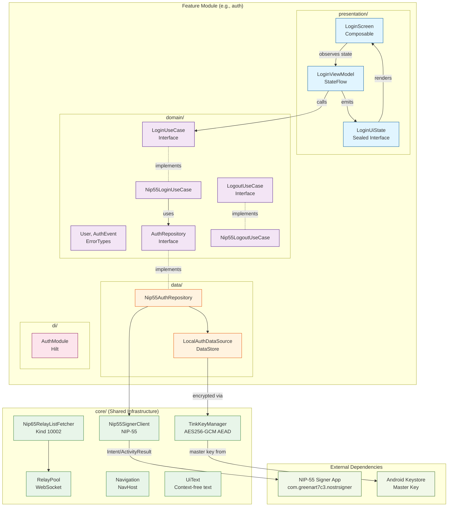

# Project Structure

## Organization Philosophy

**Package-by-Feature Architecture** with Clean Architecture principles within each feature.
Features are self-contained vertical slices containing domain, data, and presentation layers.
Shared infrastructure lives in `core/` package.

## Architecture Diagram



**Flow**: UI → ViewModel → UseCase → Repository → DataSource → External Services

**Dependency Direction**: Outer layers depend on inner layers (Presentation → Domain ← Data)

## Directory Patterns

### Feature Modules (`feature/`)

**Location**: `app/src/main/java/io/github/omochice/pinosu/feature/`
**Purpose**: Self-contained vertical slices with internal Clean Architecture layers

**Features**:

- `auth/` - Login, logout, session management
- `bookmark/` - Bookmark listing and display
- `postbookmark/` - Creating and posting new bookmarks
- `comment/` - Bookmark detail screen with kind 1111/1 comments viewing and posting
- `settings/` - User preferences and display mode
- `shareintent/` - Android share intent handling (receive shared URLs/text from other apps)
- `main/` - Main screen container
- `appinfo/` - Application information
- `license/` - Open source license display

**Internal Structure Pattern** (per feature):

```kotlin
feature/{name}/
├── domain/
│   ├── model/       // Feature-specific entities
│   ├── repository/  // Repository interfaces (abstractions)
│   └── usecase/     // Business use cases (interface + implementation)
├── data/
│   ├── repository/  // Repository implementations only
│   ├── local/       // DataStore sources
│   └── metadata/    // External data fetching
├── presentation/
│   ├── viewmodel/   // ViewModel + *UiState.kt files
│   └── ui/          // Compose screens
└── di/              // Feature-scoped Hilt module
```

### Core Package (`core/`)

**Location**: `app/src/main/java/io/github/omochice/pinosu/core/`
**Purpose**: Shared infrastructure, cross-cutting concerns

**Subpackages**:

- `crypto/` - Encryption utilities (TinkKeyManager)
- `di/` - Core Hilt modules (NetworkModule, RelayPoolModule)
- `model/` - Shared DTOs (NostrEvent, UnsignedNostrEvent, Pubkey, UserProfile)
- `navigation/` - App navigation (NavHost, animations)
- `nip/` - Nostr protocol implementations
    - `nip01/` - NIP-01 user metadata fetcher (kind 0, cached batch)
    - `nip19/` - NIP-19 Bech32 entity resolver
    - `nip55/` - NIP-55 signer client
    - `nip65/` - NIP-65 relay list fetcher
- `relay/` - WebSocket relay client (RelayPool, PublishResult)
- `timestamp/` - Timestamp formatting utilities (java.time based)
- `ui/` - Core UI abstractions (UiText for context-free text handling)

### Shared UI (`ui/`)

**Location**: `app/src/main/java/io/github/omochice/pinosu/ui/`
**Purpose**: Shared Compose components and theme

**Subdirectories**:

- `theme/` - Material Design 3 theme
- `component/` - Reusable dialogs (ErrorDialog, UrlSelectionDialog)
- `drawer/` - Navigation drawer components

### Root DI (`di/`)

**Location**: `app/src/main/java/io/github/omochice/pinosu/di/`
**Purpose**: Cross-feature Hilt bindings

**Example**: `RepositoryModule.kt` - NIP-65 parser/fetcher bindings

## Naming Conventions

- **Files**: PascalCase matching class names (e.g., `Nip55LoginUseCase.kt`)
- **Packages**: Lowercase, grouped by feature then layer (`feature/auth/domain/usecase`)
- **Classes**: PascalCase with descriptive suffixes (`LoginViewModel`, `AuthRepository`)
- **Interfaces**: PascalCase without "I" prefix (e.g., `LoginUseCase`, `AuthRepository`)
- **Hilt Modules**: Feature-scoped (e.g., `AuthModule`, `BookmarkModule`)

## Package Organization

```kotlin
io.github.omochice.pinosu/
├── MainActivity.kt          // Entry point
├── PinosuApplication.kt     // Hilt application
├── core/                    // Shared infrastructure
│   ├── crypto/              // TinkKeyManager
│   ├── di/                  // NetworkModule, RelayPoolModule
│   ├── model/               // NostrEvent, UnsignedNostrEvent, Pubkey
│   ├── navigation/          // NavHost, animations
│   ├── nip/                 // NIP protocol implementations
│   │   ├── nip01/           // User metadata fetcher (kind 0)
│   │   ├── nip19/           // Bech32 entity resolver
│   │   ├── nip55/           // Signer client
│   │   └── nip65/           // Relay list fetcher
│   ├── relay/               // RelayPool, PublishResult
│   ├── timestamp/           // Timestamp formatting (java.time)
│   └── ui/                  // UiText abstraction
├── feature/                 // Feature modules (vertical slices)
│   ├── auth/                // Authentication feature
│   ├── bookmark/            // Bookmark list feature
│   ├── postbookmark/        // Post bookmark feature
│   ├── comment/             // Bookmark detail with comments (kind 1111/1)
│   ├── settings/            // Settings feature
│   ├── shareintent/         // Share intent handling
│   ├── main/                // Main screen
│   ├── appinfo/             // App info screen
│   └── license/             // License screen
├── di/                      // Cross-feature Hilt modules
└── ui/                      // Shared UI components
    ├── theme/               // Material 3 theme
    ├── component/           // Reusable dialogs
    └── drawer/              // Navigation drawer
```

## Code Organization Principles

- **Feature Cohesion**: Each feature is a self-contained vertical slice
- **Dependency Rule**: Domain layer has no dependencies on data or presentation
- **Dependency Inversion**: Repository interfaces live in `domain/repository/`, implementations in `data/repository/`
- **Interface Segregation**: Use cases and repositories defined as interfaces
- **Single Responsibility**: Each class/file has one clear purpose
- **Core for Sharing**: Only infrastructure shared across features lives in `core/`
- **Feature DI Modules**: Each feature has its own Hilt module (e.g., `AuthModule`)
- **State Management**: Immutable data classes with StateFlow for reactive UI updates

---

_Updated: 2026-03-02 - Added nip01/ to core/nip/; UserProfile to core/model/_
