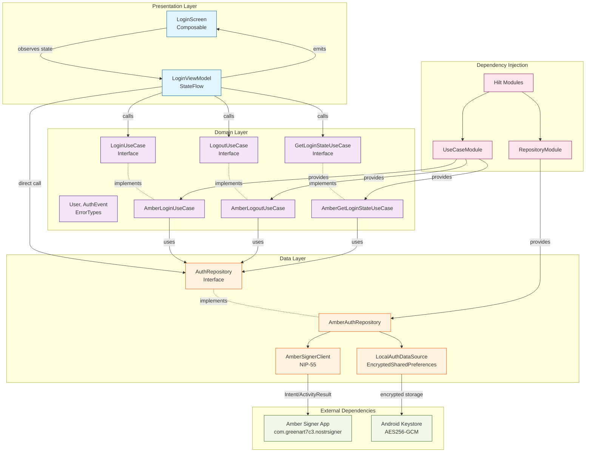

# Project Structure

## Organization Philosophy

**Clean Architecture** with strict layer separation: Domain → Data → Presentation.
Business logic is independent of frameworks, UI, and external dependencies.

## Architecture Diagram



**Flow**: UI → ViewModel → UseCase → Repository → DataSource → External Services

**Dependency Direction**: Outer layers depend on inner layers (Presentation → Domain ← Data)

## Directory Patterns

### Domain Layer (`domain/`)

**Location**: `app/src/main/java/io/github/omochice/pinosu/domain/`
**Purpose**: Business logic, entities, and use case interfaces
**Example**: `usecase/AmberLoginUseCase.kt`, `model/User.kt`, `model/error/ErrorTypes.kt`

**Pattern**: Interface-based design, no Android/framework dependencies

### Data Layer (`data/`)

**Location**: `app/src/main/java/io/github/omochice/pinosu/data/`
**Purpose**: Repository implementations, data sources, external service clients
**Example**: `repository/AmberAuthRepository.kt`, `local/LocalAuthDataSource.kt`, `amber/AmberSignerClient.kt`

**Pattern**: Repository pattern with separate local/remote data sources

### Presentation Layer (`presentation/`)

**Location**: `app/src/main/java/io/github/omochice/pinosu/presentation/`
**Purpose**: ViewModels and UI state management
**Example**: `viewmodel/LoginViewModel.kt` with `LoginUiState`, `MainUiState`

**Pattern**: MVVM with StateFlow, Hilt-injected ViewModels

### UI Layer (`presentation/ui/`)

**Location**: `app/src/main/java/io/github/omochice/pinosu/presentation/ui/`
**Purpose**: Jetpack Compose screens and components
**Example**: `LoginScreen.kt`

**Pattern**: Composable functions observing ViewModel state

### Dependency Injection (`di/`)

**Location**: `app/src/main/java/io/github/omochice/pinosu/di/`
**Purpose**: Hilt modules for dependency provision
**Example**: `RepositoryModule.kt`, `UseCaseModule.kt`

**Pattern**: Separate modules per layer (Repository, UseCase)

## Naming Conventions

- **Files**: PascalCase matching class names (e.g., `AmberLoginUseCase.kt`)
- **Packages**: Lowercase, grouped by layer then feature (`domain/usecase`, `data/repository`)
- **Classes**: PascalCase with descriptive suffixes (`LoginViewModel`, `AuthRepository`)
- **Interfaces**: PascalCase without "I" prefix (e.g., `LoginUseCase`, `AuthRepository`)

## Package Organization

```kotlin
io.github.omochice.pinosu/
├── domain/          // Core business logic
│   ├── model/       // Entities and value objects
│   └── usecase/     // Business use cases
├── data/            // Data access implementations
│   ├── repository/  // Repository implementations
│   ├── local/       // Local storage (EncryptedSharedPreferences)
│   └── amber/       // External service clients
├── presentation/    // UI layer
│   ├── viewmodel/   // State management
│   ├── ui/          // Compose screens
│   └── navigation/  // Navigation graphs
├── di/              // Dependency injection
└── ui/              // Theme and design system
```

## Code Organization Principles

- **Dependency Rule**: Inner layers (domain) have no dependencies on outer layers (data, presentation)
- **Interface Segregation**: Use cases and repositories defined as interfaces in domain layer
- **Single Responsibility**: Each class/file has one clear purpose
- **Feature Organization**: Group by technical layer first, then by feature within layers
- **State Management**: Immutable data classes with StateFlow for reactive UI updates
