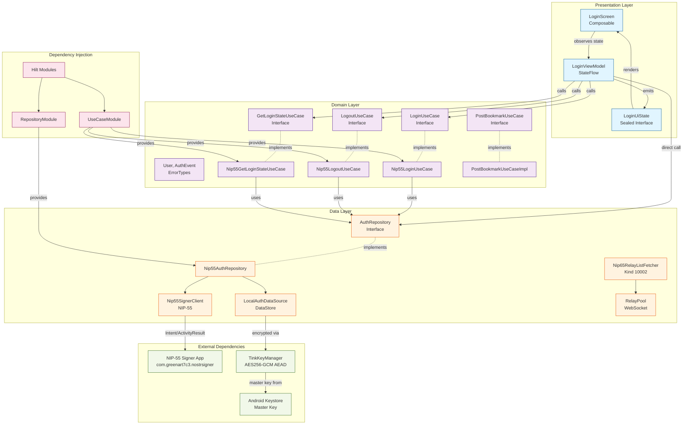

# Project Structure

## Organization Philosophy

**Clean Architecture** with strict layer separation: Domain → Data → Presentation.
Business logic is independent of frameworks, UI, and external dependencies.

## Architecture Diagram



**Flow**: UI → ViewModel → UseCase → Repository → DataSource → External Services

**Dependency Direction**: Outer layers depend on inner layers (Presentation → Domain ← Data)

## Directory Patterns

### Domain Layer (`domain/`)

**Location**: `app/src/main/java/io/github/omochice/pinosu/domain/`
**Purpose**: Business logic, entities, and use case interfaces
**Example**: `usecase/Nip55LoginUseCase.kt`, `model/User.kt`, `model/error/ErrorTypes.kt`

**Pattern**: Interface-based design, no Android/framework dependencies

### Data Layer (`data/`)

**Location**: `app/src/main/java/io/github/omochice/pinosu/data/`
**Purpose**: Repository implementations, data sources, external service clients
**Example**: `repository/Nip55AuthRepository.kt`, `local/LocalAuthDataSource.kt`, `nip55/Nip55SignerClient.kt`

**Pattern**: Repository pattern with separate local/remote data sources

**Subpackages**:

- `repository/`: Repository implementations (Auth, Bookmark, Settings)
- `local/`: DataStore data sources with encrypted serializers (migrated from EncryptedSharedPreferences)
- `crypto/`: Encryption utilities (TinkKeyManager for DataStore encryption)
- `nip55/`: NIP-55 signer client
- `nip65/`: NIP-65 relay list fetcher (Nip65RelayListFetcher, Nip65EventParser)
- `relay/`: WebSocket relay client for Nostr events (RelayPool, PublishResult)
- `metadata/`: URL metadata fetching (Open Graph)
- `model/`: Data transfer objects (NostrEvent, UnsignedNostrEvent)
- `util/`: Utilities (Bech32 encoding via Quartz)

### Presentation Layer (`presentation/`)

**Location**: `app/src/main/java/io/github/omochice/pinosu/presentation/`
**Purpose**: ViewModels and UI state management
**Example**: `viewmodel/LoginViewModel.kt`, `viewmodel/PostBookmarkViewModel.kt`

**Pattern**: MVVM with StateFlow, Hilt-injected ViewModels

**UI State Pattern**: Separate files for UI state classes (e.g., `LoginUiState.kt`, `MainUiState.kt`, `BookmarkUiState.kt`). Use sealed interfaces for type-safe state management with exhaustive when expressions.

### UI Layer (`presentation/ui/`)

**Location**: `app/src/main/java/io/github/omochice/pinosu/presentation/ui/`
**Purpose**: Jetpack Compose screens and components
**Example**: `LoginScreen.kt`, `MainScreen.kt`, `BookmarkScreen.kt`, `PostBookmarkScreen.kt`, `SettingsScreen.kt`, `AppInfoScreen.kt`, `LicenseScreen.kt`

**Pattern**: Composable functions observing ViewModel state

**Subdirectories**:

- `component/`: Reusable Compose dialogs and widgets (ErrorDialog, UrlSelectionDialog)
- `drawer/`: Navigation drawer components (AppDrawer, DrawerMenuItem)

### Dependency Injection (`di/`)

**Location**: `app/src/main/java/io/github/omochice/pinosu/di/`
**Purpose**: Hilt modules for dependency provision
**Example**: `RepositoryModule.kt`, `UseCaseModule.kt`, `NetworkModule.kt`, `DataStoreModule.kt`

**Pattern**: Separate modules per layer (Repository, UseCase, Network, DataStore, RelayPool)

- `NetworkModule`: Provides singleton OkHttpClient with timeout configuration
- `RepositoryModule`: Binds repository interfaces to implementations
- `UseCaseModule`: Binds use case interfaces to implementations
- `DataStoreModule`: Provides encrypted DataStore instances
- `RelayPoolModule`: Binds RelayPool interface to implementation (separated for test replacement)

## Naming Conventions

- **Files**: PascalCase matching class names (e.g., `AmberLoginUseCase.kt`)
- **Packages**: Lowercase, grouped by layer then feature (`domain/usecase`, `data/repository`)
- **Classes**: PascalCase with descriptive suffixes (`LoginViewModel`, `AuthRepository`)
- **Interfaces**: PascalCase without "I" prefix (e.g., `LoginUseCase`, `AuthRepository`)

## Package Organization

```kotlin
io.github.omochice.pinosu/
├── domain/          // Core business logic
│   ├── model/       // Entities and value objects (User, Bookmark, AuthEvent)
│   └── usecase/     // Business use cases (Login, Logout, GetBookmarkList, PostBookmark)
├── data/            // Data access implementations
│   ├── repository/  // Repository implementations (Auth, Bookmark, Settings)
│   ├── local/       // Local storage (DataStore with encrypted serializers)
│   ├── crypto/      // Encryption utilities (TinkKeyManager)
│   ├── nip55/       // NIP-55 signer client
│   ├── nip65/       // NIP-65 relay list fetcher
│   ├── relay/       // WebSocket relay client, PublishResult
│   ├── metadata/    // URL metadata fetcher (Open Graph)
│   ├── model/       // Data transfer objects (NostrEvent, UnsignedNostrEvent)
│   └── util/        // Utilities (Bech32)
├── presentation/    // UI layer
│   ├── viewmodel/   // State management (ViewModels + separate *UiState files)
│   ├── ui/          // Compose screens (Login, Main, Bookmark, PostBookmark, Settings, AppInfo, License)
│   │   ├── component/   // Reusable dialogs (ErrorDialog, UrlSelectionDialog)
│   │   └── drawer/      // Navigation drawer UI
│   └── navigation/  // Navigation graphs
├── di/              // Dependency injection (Network, Repository, UseCase, DataStore, RelayPool)
└── ui/              // Theme and design system
```

## Code Organization Principles

- **Dependency Rule**: Inner layers (domain) have no dependencies on outer layers (data, presentation)
- **Interface Segregation**: Use cases and repositories defined as interfaces in domain layer
- **Single Responsibility**: Each class/file has one clear purpose
- **Feature Organization**: Group by technical layer first, then by feature within layers
- **State Management**: Immutable data classes with StateFlow for reactive UI updates
